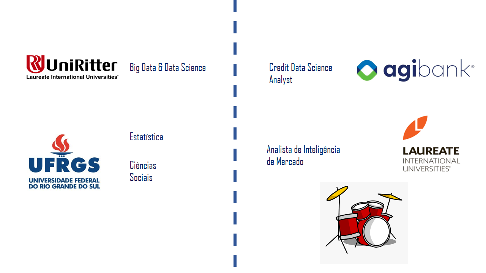
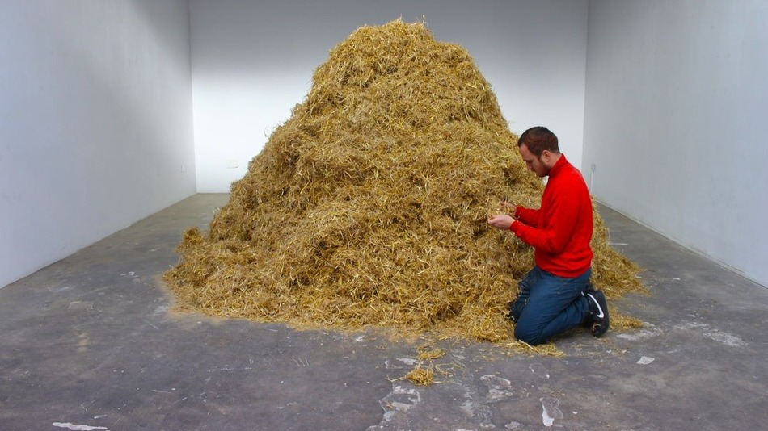
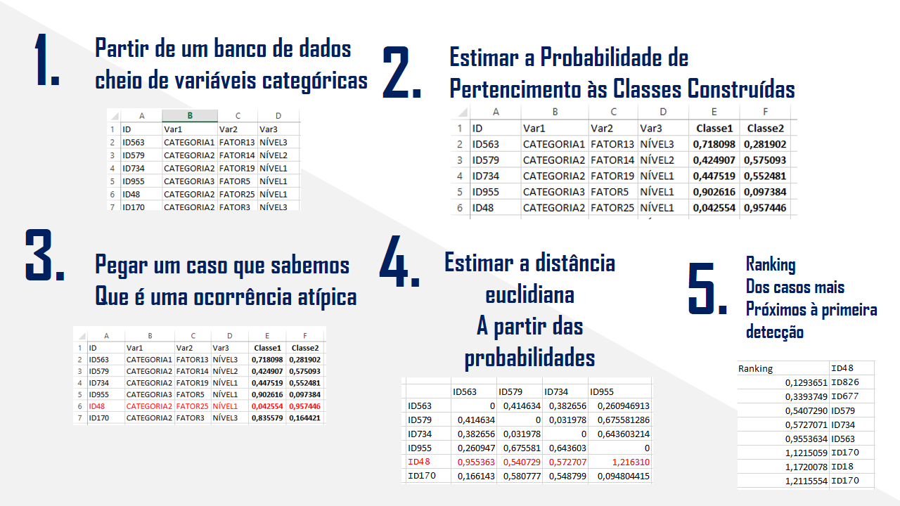

```{r setup, include=FALSE}
options(htmltools.dir.version = FALSE)
library(poLCA)
library(dplyr)
library(tidyr)
library(knitr)
knitr::opts_chunk$set(echo = FALSE, eval = T, warning = F, message = F, cache = F)

```

class: middle center bg-main1

# **Quem sou eu?**

---
class: middle, center
<div align = "center">

</div>

---


class: middle bg-main1 hide-slide-number

.outline[
## Sumário

* Motivação
* Análise de Classes Latentes
* Mas como as classes latentes são estimadas?
* Por exemplo...
* Tá, mas...Qual é a ideia?!
* require(poLCA)
]

---

class: middle center bg-main1


# **<p style = "font-size:85pt">Motivação</p>**


---
class:  bg-main5
## **<p style = "font-size:70pt">Motivação</p>**

### 
<p style = "font-size:20pt">
Quando encontramos algum caso inconsistente ou fraudulento: como revisar casos passados para verificar se o caso encontrado é único? 
</p>

<center><p style = "font-size:40pt">
Por onde começar a procurar?!
</center>
</p>
---
class: middle, center
<div align = "center">

</div>
<!-- fonte da imagem: https://maiscotidiano.blogspot.com/2014/11/homem-tenta-literalmente-procurar-uma-agulha-em-um-palheiro.html último acesso:27/10/2019 -->


---
class: split-two white

.column.bg-main1[.content[
<center>  
# **Motivação**

  ##<p style="margin-bottom:2cm; margin-top:2cm; font-size:40pt"> Utilizar algum método que consiga encontrar <i>similaridade</i> entre os diversos casos e, assim, priorizar aqueles que mais se ''pareçam'' com o caso detectado   .</p>

  
</center>

]]
.column.bg-main2[.content[
<center>  


</div>
<!-- fonte da imagem: https://blogs.ibahia.com/a/blogs/blogdoinvestidor/2012/04/19/agulha-no-palheiro-19-04-2012/ último acesso: 27/10/2019 -->

</center>
]]bsites.

---
class: middle center bg-main1

# **<p style = "font-size:70pt">Análise de Classes Latentes</p>**


---
class: split-two white

.column.bg-main1[.content[
<center>  


</div>
<!-- fonte da imagem: https://pt.wikipedia.org/wiki/Paul_Lazarsfeld último acesso: 27/10/2019 -->

## <center><br>Paul Felix Lazarsfeld </center></br>
<i>The logical and mathematical foundation of latent structure analysis & The interpretation and mathematical foundation
of latent structure analysis. </i>
  
</center>

]]
.column.bg-main2[.content[
<center>  


</div>
<!-- fonte da imagem: https://galton.uchicago.edu/faculty/emeriti/goodman/index.shtml último acesso: 27/10/2019 -->

##<center><br> Leo A. Goodman</center></br>
<i> The analysis of systems of qualitative variables
when some of the variables are unobservable. Part I: A modified latent
structure approach</i>

</center>
]]bsites.

---
class: middle bg-main3

# Análise de Classes Latentes

<!-- 
Link legal!!
statisticshowto.datasciencecentral.com/latent-class-analysis-definition/ 
algoritmo equivalente à definição da média mais próxima com convergência, implementada no K-means,
essa metrica, de distancia euclidiana funciona bem para variaveis continuas, porem para variaveis categorias??
problema de trabalhar com missing data
e falta de criterios estatisticos para definir os grupos.
A ideia basica eh a de que podemos explicar as associacoes das variaveis observadas num numero menor de grupos 'varivavel multinominal'
Link muito interesante: https://www.youtube.com/watch?v=Anzoq3VDEB0. útlimo acesso: 03/11/2019 -->
* **<p style = "font-size:25pt"><i>Clusterização</i></p>** 
    <p style = "font-size:15pt">- formação de grupos a partir de padrões de resposta dos indivíduos; </p>
    
* **<p style = "font-size:25pt">Análise Fatorial</p>** 
    <p style = "font-size:15pt">- vincula-se à literatura de variáveis latentes (todas as combinações de respostas podem ser resumidas por um número menor de grupos);</p>
    
* **<p style = "font-size:25pt">Método propício para variáveis categóricas</p>**
    <p style = "font-size:15pt">- utilização de probabilidades na definição de grupos;</p>
    
* **<p style = "font-size:25pt">Estatísticas de Ajuste</p>** 
    <p style = "font-size:15pt">- Entropia, AIC, BIC...; </p>
    um BAITA resumo da utilização dessas estatísticas para o LCA está na página 14 e adiante deste  [trabalho](https://lume.ufrgs.br/bitstream/handle/10183/133682/000986100.pdf?sequence=1&isAllowed=y) 
    

---

class: middle center bg-main1

# **Mas como as classes latentes são estimadas?**

---
class: middle center bg-main1
<!-- link utilizado: https://pdfs.semanticscholar.org/8149/dc67491a4fc68a2cb4281d26fc42033ced0f.pdf 
Assumindo que, dentro de cada classe latente, as variaveis sao independentes. Porque queremos que as CLASSES
capturem a relação entre as variaveis na população. 
Essa probabilidade condicional permite o calculo de uma probabilidade a posteriori

Verossimilhança Condicional -->

# Estimando Probabilidade de pertencimento a uma classe, dado um padrão de respostas
<br>
<br>
<br>
$$ P(X= x \mid \mathbf{Y = y}) = \frac{P( X = x) P(\mathbf{Y = y} \mid X = x)}{P(\mathbf{Y = y})}, $$
onde $P(X=x)$ é a probabilidade de pertencimento à classe $x$ e $\mathbf{y}$ representa o padrão das respostas categóricas.
---

class: middle center bg-main1

# **Por exemplo...**

---
class: middle left bg-main7


$$P_{Fulano, CL1}  = \frac{P(X=1) \times P( Y1, Y2, Y3 \mid Y1_1, Y2_1, Y3_1)}{P(X=1) \times P(Y1, Y2, Y3 \mid Y1_1, Y2_1, Y3_1) + P(X=2) \times P(Y1, Y2, Y3 \mid Y1_2, Y2_2, Y3_2)} $$


* Para tanto, 
1. Definir um $P(X=1)$ e $P(x=2)$ aleatórios
2. Calcular um $P( Y1, Y2, Y3 \mid Y1_1, Y2_1, Y3_1)$ e $P( Y1, Y2, Y3 \mid Y1_2, Y2_2, Y3_2)$, ponderados por $P(X=1)$ e $P(X=2)$
3. Atualizar $P(X=1)$ e $P(X=2)$
4. Calcular novas probabilidades de pertencimento
5. Repetir passos 2 a 4 até não se alterarem significativamente mais.

Para uma visão bem melhor explicada que a minha, olhar [esse link](https://www.youtube.com/watch?v=Anzoq3VDEB0) e [esse outro aqui](https://pdfs.semanticscholar.org/8149/dc67491a4fc68a2cb4281d26fc42033ced0f.pdf).

---

class: middle center bg-main1

# **<p style = "font-size:70pt">Tá, mas...Qual é a ideia?!</p>**

---
class: middle, center
<div align = "center">

</div>


---

class: middle center bg-main1

# **require(poLCA)**


---


class: middle center bg-main1


## [E-mail](mailto:faraon.renan@gmail.com): faraon.renan@gmail.com
## [github](https://github.com/renancintra): https://github.com/renancintra
## [Linkedin](https://www.linkedin.com/in/renan-cintra-2b830011a/):  https://www.linkedin.com/in/renan-cintra-2b830011a/


